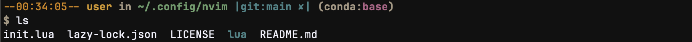

# 打造你的专属终端：无插件版 Oh My Bash/Oh My Zsh

---
大家在使用bash或zsh的时候，可能都会想要安装ohmybash/ohmyzsh这样的插件来让终端变得更好看、更好用。但是你有没有发现，安装这些插件后终端变得有点卡顿了呢？这是因为这些插件在启动的时候会加载很多配置文件，导致终端运行变慢了。

不过别担心！其实我们完全可以通过修改.bashrc或.zshrc配置文件来实现这些插件的大部分功能，而且不会让终端变得那么慢。

接下来我们就以bash为例，一步步地把终端打造得既好看又好用~
## 1. 历史记录补全
下面这些配置代码其实在你的.bashrc里已经有了，不过我们可以稍微调整一下让它变得更好用。
```bash
# don't put duplicate lines or lines starting with space in the history.
# See bash(1) for more options
HISTCONTROL=ignoreboth   # 忽略重复命令和以空格开头的命令

# append to the history file, don't overwrite it
shopt -s histappend # 将命令追加到历史文件，而非覆盖

# for setting history length see HISTSIZE and HISTFILESIZE in bash(1)
HISTSIZE=1000  # 内存中的历史记录条数
HISTFILESIZE=2000 # 历史文件中的历史记录条数

# check the window size after each command and, if necessary,
# update the values of LINES and COLUMNS.
shopt -s checkwinsize # 每次命令后检查窗口大小并自动调整
```
这里的HISTSIZE和HISTFILESIZE数值可以根据自己的需要调整，比如我就喜欢设置得大一点，这样就能记住更多以前用过的命令了

接下来是一个超级实用的小技巧，可以让上下箭头键变得更智能：
```bash
# 启用上/下箭头键的前缀历史搜索
bind '"\e[A": history-search-backward'
bind '"\e[B": history-search-forward'
```
这两行代码的作用是：
```txt
1. bind '"\e[A": history-search-backward' - 将上箭头键（ \e[A ）绑定到 history-search-backward 功能
2. bind '"\e[B": history-search-forward' - 将下箭头键（ \e[B ）绑定到 history-search-forward 功能
```
在.bashrc中添加这两行代码，你就可以这样使用了：
1. 先输入命令的开头几个字母（比如 'git'）
2. 然后按上箭头键，终端就会自动找到之前用过的以'git'开头的命令
3. 继续按上箭头键就会显示更早的匹配命令
4. 按下箭头键则可以往回翻
是不是很方便呢？再也不用一个个翻历史记录了。


## 2.自定义主题配置

说到终端主题，大家最熟悉的可能就是这样的样式：
```bash
user@hostname:~$
```
这是bash默认的提示符，其中 ~ 表示你现在在自己的主目录里。
如果你是Python用户，安装了Anaconda的话，可能会看到这样的提示符：
```bash
(base)user@hostname:~$
```
开头的 (base) 告诉你当前正在使用conda的base环境，不过这样的提示符看起来有点单调，而且信息也不够丰富。别着急，接下来我们就来打造一个超酷的自定义主题。通过修改.bashrc文件中的PS1变量，我们可以让终端变得既好看又实用。


看看下面这张图，这就是我们要实现的效果：

是不是看起来很棒？😊 接下来我们就一步步来实现它！


### 2.1 让终端支持更多颜色
首先要让终端支持更丰富的颜色显示，这样我们的主题才能五彩缤纷，需要在.bashrc文件中添加以下代码：
```bash
# 终端颜色设置
if [[ $COLORTERM = gnome-* && $TERM = xterm ]] && infocmp gnome-256color &>/dev/null; then
  export TERM=gnome-256color
elif [[ $TERM != dumb ]] && infocmp xterm-256color &>/dev/null; then
  export TERM=xterm-256color
fi
```

自定义我们想要使用的颜色变量，例如：
```bash
# 定义颜色变量
MAGENTA='\[\e[1;31m\]'     # 红
YELLOW='\[\e[1;33m\]'      # 黄
WHITE='\[\e[1;37m\]'       # 白
ORANGE='\[\e[38;5;172m\]'  # 橙色
CYAN='\[\e[1;36m\]'        # 青
BLUE='\[\e[1;34m\]'        # 蓝
PURPLE='\[\e[1;35m\]'      # 紫
RESET='\[\e[0m\]'          # 重置
```
这些颜色代码看起来可能有点复杂，不过别担心，我来解释一下它们的格式，这些颜色代码使用的是ANSI转义序列：
```txt
\[ 和 \] 是Bash特有的标记，告诉bash这些字符不是真的要显示出来的
\e[ 是转义序列的开始，是颜色设置的开始标记
1; 表示加粗文本
后面的数字就是具体的颜色代码，比如31m就是红色
m 表示转义序列的结束
最特别的是橙色，它用了256色模式，所以格式稍微不同一些
```


### 2.2终端标题栏设置

接下来我们来设置终端窗口的标题栏，这样你就能一眼看到当前在哪个目录啦：
```bash
case $TERM in
    xterm*|rxvt*)
        TITLEBAR='\[\e]0;\w\a\]'
        ;;
    *)
        TITLEBAR=""
        ;;
esac
```

让我们来看看这个case语句是怎么工作的：


这样设置之后，在支持的终端里，你就能在标题栏看到当前目录的路径啦！比如在VSCode的终端或者iTerm2里都可以😊（推荐一下[ghostty终端](https://github.com/ghostty-org/ghostty)）
1. `case $TERM in` 
   这行代码会检查你当前使用的终端类型。就像问"你用的是什么终端呀？"

2. `xterm*|rxvt*)`
   这是在匹配终端类型名称：
   - `xterm*` 匹配所有以xterm开头的终端，比如xterm、xterm-256color
   - `|` 表示"或者"
   - `rxvt*` 匹配所有以rxvt开头的终端
   
3. `TITLEBAR='\[\e]0;\w\a\]'`
   如果是上面这些终端类型，就设置一个特殊的标题栏格式：
   - 这个格式会在标题栏显示你当前的工作目录
   - 这样你打开很多终端窗口时，一眼就能看出每个窗口在哪个目录~

4. `;;`
   表示这个选项的设置到此结束啦

5. `*)`
   这个星号表示"其他所有情况"，就像是在说"如果都不是上面的终端类型..."

6. `TITLEBAR=""`
   对于其他类型的终端，就不设置标题栏了（因为可能不支持这个功能）

7. `esac`
   case语句结束，esac就是case倒着写（很有趣吧！）
这段代码会根据你的终端类型来决定是否显示标题栏。使用之后，你会发现：

- 在主目录时，标题栏显示一个简单的 ~
- 在其他目录时，比如 /var/log ，标题栏会显示完整的路径，再也不会忘记自己在哪个目录了 😄


### 2.3 Screen会话信息
虽然现在有很多现代的终端复用工具（比如tmux或zellij），但是对于一些简单的后台任务，我还是喜欢用screen。它就像一个轻量级的"窗口管理器"，特别适合那些你只需要挂着跑、不用经常查看的任务，所以我在这里也设置一下screen的标题栏。
```bash
function screen_info() {
    if [[ -n "$STY" ]]; then
        echo -e "${MAGENTA}[screen:${STY##*.}]${RESET}"
    fi
}
```
这个函数检测当前是否在GNU Screen会话中，如果是则显示会话信息：
```txt
-n "$STY" 检查是否存在Screen会话
${STY##*.} 提取Screen会话的编号
输出格式为红色的 [screen:会话编号]
```
这样你打开多个screen窗口时，一眼就能分清楚在哪个会话里了。


### 2.4 Git分支检测
这个可能是最实用的功能之一了，对于我们这些经常使用Git的来说，实时知道Git仓库的状态特别重要：
```bash
# Git分支检测
function git_branch() {
    local branch  # 声明局部变量，避免污染全局命名空间
    if branch=$(git rev-parse --abbrev-ref HEAD 2>/dev/null); then
        if [[ "$branch" == "HEAD" ]]; then
            branch="detached*"
        fi
        # 检查 git 状态
        local git_status
        if git diff --quiet 2>/dev/null >/dev/null && git diff --staged --quiet 2>/dev/null >/dev/null; then
            git_status="✔"
        else
            git_status="✘"
        fi
        echo -e "${BLUE} |git:${branch} ${git_status}|"
    fi
}
```
这个功能会告诉你：

- 你现在在哪个分支上
- 用✔表示所有改动都已提交
- 用✘提醒你还有未提交的改动

让我们来看看这个Git检测功能的每个部分是怎么工作的：

1. 首先，我们声明了一个叫`branch`的局部变量
   - 这样做是为了保持整洁，不会影响到其他地方的变量
   - 就像是给这个分支名字准备一个专门的小抽屉

2. 获取Git分支名称
   - 使用`git rev-parse --abbrev-ref HEAD`命令
   - 加上`--abbrev-ref`参数是为了显示友好的分支名
   - 比如显示`main`而不是一串看不懂的数字和字母
   - `2>/dev/null`的作用是悄悄处理错误信息，这样在非Git目录下就不会显示烦人的错误提示啦

3. 特殊情况处理
   - 如果你不小心进入了"分离头指针"状态（就是没有在任何分支上）
   - Git会返回"HEAD"这个词
   - 我们把它改成更友好的"detached*"提示
   - 这样你一眼就能看出现在的状态不太对劲

4. Git状态检查
   - 使用`git diff --quiet`检查是否有改动没有提交
   - 如果所有改动都已经提交了，显示一个开心的✔
   - 如果还有改动没提交，显示一个提醒的✘
   - 这就像是一个小助手，时刻提醒你代码的状态~

最终效果：
- 在Git仓库里时，你会看到类似`|git:main ✔|`这样的提示
- 蓝色显示，特别醒目
- 一眼就能看出：
  - 当前在哪个分支
  - 是否有未提交的改动
  - 是否处于特殊状态


### 2.5 venv/conda环境检测
这个函数用于检测并显示当前激活的Python虚拟环境信息，它可以同时支持标准的Python virtualenv和Anaconda环境。
```bash
function conda_venv() {
    if [[ -n "$VIRTUAL_ENV" ]]; then
        echo -e "${WHITE}(venv:${PURPLE}$(basename $VIRTUAL_ENV)${WHITE}) "
    elif [[ -n "$CONDA_DEFAULT_ENV" ]]; then
        echo -e "${WHITE}(conda:${PURPLE}$(basename $CONDA_DEFAULT_ENV)${WHITE}) "
    fi
}
```
它会：

1. 先检查是否在标准的Python虚拟环境中
   
   - 通过检查 $VIRTUAL_ENV 变量是否存在
   - 如果存在，显示类似 (venv:项目环境) 这样的提示
2. 如果不是virtualenv，再检查是否在conda环境中
   
   - 通过检查 $CONDA_DEFAULT_ENV 变量
   - 如果存在，显示类似 (conda:base) 这样的提示
3. 使用 basename 命令提取环境名称
   
   - 这样就不会显示冗长的完整路径
   - 只显示最后一级目录名，简洁明了
  
这样设置后，你随时都能清楚地知道：
- 当前是否在虚拟环境中
- 是哪种类型的虚拟环境（venv还是conda）
- 环境的名称是什么


### 2.6 自定义时间显示
每次执行命令时知道具体时间很有用，尤其是在做一些耗时操作或者记录操作日志的时候。来看看这个简洁又实用的时钟显示功能：
```bash
# 自定义时间显示
function my_clock() {
    echo -e "${ORANGE}--$(date +%H:%M:%S)--${RESET}"
}
```

```txt
${ORANGE} 使用之前定义的橙色
-- 装饰性的横线 （用两个小横线把时间框起来，让它看起来更有清楚）
$(date +%H:%M:%S) 获取当前系统时间
-- 结尾的装饰性横线
${RESET} 最后记得重置颜色，这样不会影响后面的文字显示
```

### 2.7 把所有功能组合在一起

现在我们已经准备好了所有的组件，是时候把它们组合成一个漂亮的提示符了！这个部分就像是在搭积木，我们把前面做好的每个功能都拼在一起：
```bash
function build_prompt() {
    PS1="${TITLEBAR}$(screen_info)$(my_clock) ${YELLOW}\u ${WHITE}in ${CYAN}\w$(git_branch) $(conda_venv)\n${WHITE}\$ ${RESET}"
}
#设置PROMPT_COMMAND
PROMPT_COMMAND=build_prompt
#确保提示符每次更新
export PROMPT_COMMAND
```
让我们来看看这个"积木"是怎么搭起来的：
```txt
build_prompt() 函数的作用是构建 bash 的提示符，它通过设置 PS1 变量来实现。PS1 变量的组成部分如下：

${TITLEBAR} 设置终端窗口的标题栏
$(screen_info) 如果在 screen 会话中，显示会话信息
$(my_clock) 显示当前时间
${YELLOW}\u 黄色显示当前用户名（\u 是用户名的特殊符号）
${WHITE}in 白色显示单词 "in"
${CYAN}\w 青色显示当前工作目录（\w 是当前目录的特殊符号）
$(git_branch) 如果在 git 仓库中，显示分支信息
$(conda_venv) 如果在 Python 虚拟环境中，显示环境信息
\n 换行符 (为了将$或#提示符移到下一行)
${WHITE}\$ 白色显示提示符符号（普通用户是 $，root 用户是 #）
${RESET} 重置所有颜色设置
```
还需要：
```bash
# 设置PROMPT_COMMAND，让提示符随时更新
PROMPT_COMMAND=build_prompt
# 导出这个设置，让子shell也能继承
export PROMPT_COMMAND
```
这样做的好处是：

- 每次你输入命令前，提示符都会自动更新
- 时间、Git状态等信息都是实时的
- 即使你打开新的终端窗口，设置也会保持一致

最终效果就像一个贴心的小助手：
- 告诉你现在几点了
- 提醒你在哪个目录
- 监控着Git的状态
- 记住你用的是哪个Python环境

完整的代码如下，只需添加到.bashrc文件中即可不安装oh-my-bash插件而使用该自定义主题：

```bash
# ~/.bashrc 自定义主题配置

# 终端颜色设置
if [[ $COLORTERM = gnome-* && $TERM = xterm ]] && infocmp gnome-256color &>/dev/null; then
  export TERM=gnome-256color
elif [[ $TERM != dumb ]] && infocmp xterm-256color &>/dev/null; then
  export TERM=xterm-256color
fi

# 定义颜色变量（加粗版本）
MAGENTA='\[\e[1;31m\]'     # 亮红
YELLOW='\[\e[1;33m\]'      # 黄
WHITE='\[\e[1;37m\]'       # 白
ORANGE='\[\e[38;5;172m\]'  # 橙色（使用256色）
CYAN='\[\e[1;36m\]'        # 青
BLUE='\[\e[1;34m\]'        # 蓝
PURPLE='\[\e[1;35m\]'      # 紫
RESET='\[\e[0m\]'          # 重置

# 终端标题栏设置
case $TERM in
    xterm*|rxvt*)
        TITLEBAR='\[\e]0;\w\a\]'
        ;;
    *)
        TITLEBAR=""
        ;;
esac

# Screen会话信息检测
function screen_info() {
    if [[ -n "$STY" ]]; then
        echo -e "${MAGENTA}[screen:${STY##*.}]${RESET}"
    fi
}

# Git分支检测
function git_branch() {
    local branch  # 声明局部变量，避免污染全局命名空间
    if branch=$(git rev-parse --abbrev-ref HEAD 2>/dev/null); then
        if [[ "$branch" == "HEAD" ]]; then
            branch="detached*"
        fi
        # 检查 git 状态
        local git_status
        if git diff --quiet 2>/dev/null >/dev/null && git diff --staged --quiet 2>/dev/null >/dev/null; then
            git_status="✔"
        else
            git_status="✘"
        fi
        echo -e "${BLUE} |git:${branch} ${git_status}|"
    fi
}

# Python虚拟环境检测
function python_venv() {
    if [[ -n "$VIRTUAL_ENV" ]]; then
        echo -e "${WHITE}(venv:${PURPLE}$(basename $VIRTUAL_ENV)${WHITE}) "
    elif [[ -n "$CONDA_DEFAULT_ENV" ]]; then
        echo -e "${WHITE}(conda:${PURPLE}$(basename $CONDA_DEFAULT_ENV)${WHITE}) "
    fi
}

# 自定义时间显示
function my_clock() {
    echo -e "${ORANGE}--$(date +%H:%M:%S)--${RESET}"
}

# 构建提示符
function build_prompt() {
    PS1="${TITLEBAR}$(screen_info)$(my_clock) ${YELLOW}\u ${WHITE}in ${CYAN}\w$(git_branch) $(python_venv)\n${WHITE}\$ ${RESET}"
}

# 设置PROMPT_COMMAND
PROMPT_COMMAND=build_prompt

# 确保提示符每次更新
export PROMPT_COMMAND

```


