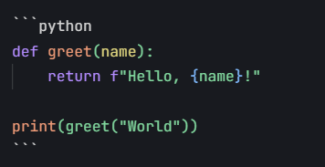

# 这是一篇测试

欢迎使用Markdown卡片，

# 一级标题，欢迎使用Markdown卡片

---

这是一个**加粗文本**和*斜体文本*的示例。

正文：

简单来说，就是提供了 dsn ，username ，password ，query 四个参数，然后通过 PDO 连接数据库，执行查询，返回查询结果。

## 1.数学公式

以下是一个数学公式的例子：

$$
f(x) = \\int_{-\\infty}^{\\infty} \\hat{f}(\\xi) e^{2 \\pi i \\xi x} d\\xi
$$

## 2.代码块

这是一个Python代码块的例子：

```python
def greet(name):
    return f"Hello, {name}!"
    # 这是一个注释

print(greet("World"))
```
## 3.链接
这是一个链接 [markdown教程](https://markdown.com.cn)

这个链接用 1 作为网址变量 [Google][1]

这个链接用 runoob 作为网址变量 [Runoob][runoob]

然后在文档的结尾为变量赋值（网址）

email 这是一个EMAIL<fake@example.com>

See the section on [`这里`](#code111).

## 4.表格
| Syntax      | Description |
| ----------- | ----------- |
| Header      | Title       |
| Paragraph   | Text        |


### 4.1单元格宽度可以变化，如下所示。呈现的输出将看起来相同。

| Syntax | Description | Test Text     |
| --- | ----------- | ----------- |
| Header | Title | Here's this   |
| Paragraph | Text | Here's this   |

### 4.2对齐

您可以通过在标题行中的连字符的左侧，右侧或两侧添加冒号（:），将列中的文本对齐到左侧，右侧或中心。

| Syntax      | Description | Test Text     |
| :---        |    :----:   |          ---: |
| Header      | Title       | Here's this   |
| Paragraph   | Text        |  Here's this   |


## 5.图片

如图所示：


设置大小：
markdown图片格式，可以直接在链接地址后添加形如=300x200（即宽x高）或=200x或=x300的数字即可调整图片大小。（推荐）


有链接的图片：

[](https://markdown.com.cn)


## 6.分割线
***

## 7.引用
### 7.1普通引用
> Dorothy followed her through many of the beautiful rooms in her castle.

### 7.2嵌套引用
>> The Witch bade her clean the pots and kettles and sweep the floor and keep the fire fed with wood. The Witch bade her clean the pots and kettles and sweep the floor and keep the fire fed with wood. The Witch bade her clean the pots and kettles and sweep the floor and keep the fire fed with wood.
>
>> The Witch bade her clean the pots and kettles。

#### 7.2.1带有其它元素的块引用

> #### The quarterly results look great!
>
> - Revenue was off the chart.
> - Profits were higher than ever.
>
>  *Everything* is going according to **plan**.


## 8.列表语法

### 8.1有序列表
要创建有序列表，请在每个列表项前添加数字并紧跟一个英文句点。数字不必按数学顺序排列，但是列表应当以数字 1 起始。

1. First item
2. Second item
3. Third item
4. Fourth item


### 8.2无序列表

- First item
- Second item
- Third item
- Fourth item


## 9.删除线

~~世界是平坦的。~~ 我们现在知道世界是圆的。


## 10.任务列表语法

- [x] Write the press release
- [ ] Update the website
- [ ] Contact the media


[1]: http://www.google.com/
[runoob]: http://www.runoob.com/